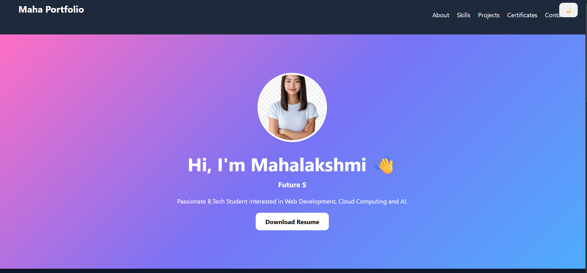
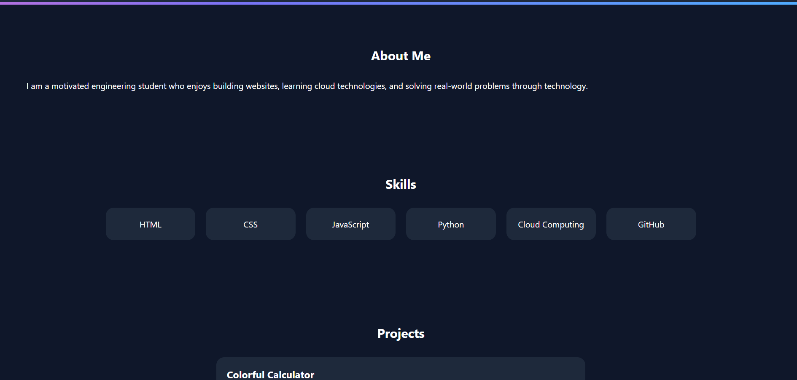
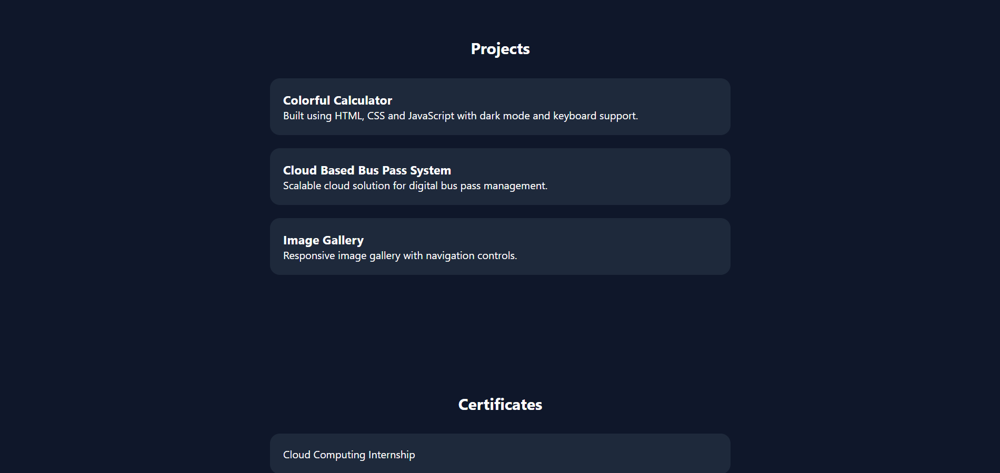
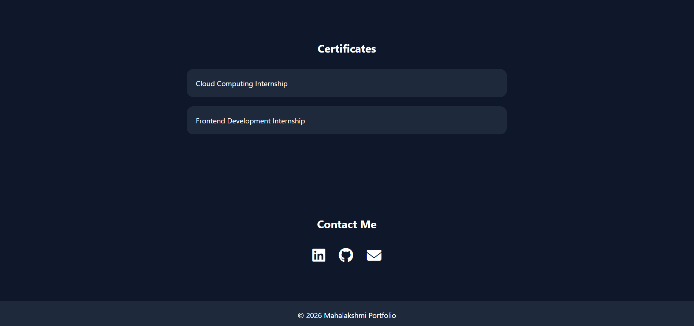

# Personal Portfolio Website

## Overview
This is a responsive personal portfolio website built using HTML and CSS. It showcases my profile, skills, projects, and contact information.

## Features
- Responsive design
- About Me section
- Skills section
- Projects showcase
- Contact information
- Clean and modern UI

## Technologies Used
- HTML5
- CSS3

## Project Structure

portfolio/
│
├── index.html
├── style.css
├── images/
│   └── profile.jpg
└── README.md

## How to Run

1. Download or clone the repository.
2. Open `index.html` in any web browser.
3. Explore the portfolio website.

## Screenshots

# Screenshots

## Portfolio Screenshot 1

## Portfolio Screenshot 2

## Portfolio Screenshot 3

## Portfolio Screenshot 4

## V.V.K. Mahalakshmi

## License

This project is created for educational and internship purposes.
